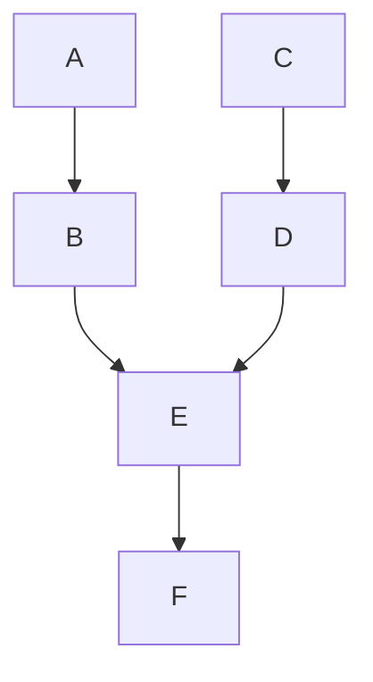

# バイパスモード

## 基本

### デフォルト

### 行番号を10から始める

## ハイライト

### 1行目をハイライトする

### 表示上の行番号を10から始め、3行目の行をハイライトする

### 3行目と5行目をハイライトする

### 3行目～5行目をハイライトする

### 1行目と3行目～5行目をハイライトする

## Deatilsでの使用

::: details バイパス

:::