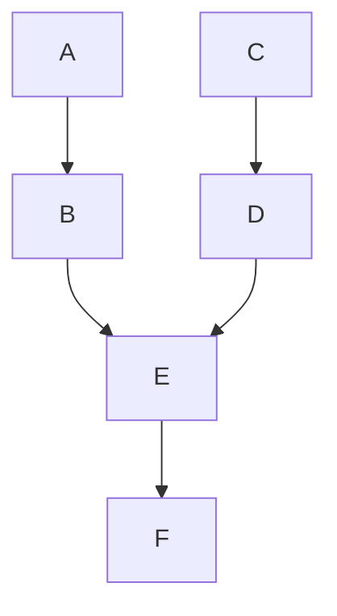

## コードグループのチェック

::: code-group

```mermaid bypass [バイパス]
graph TD
    A --> B
    C --> D
    B --> E
    D --> E
    E --> F
```

```mermaid [独自コンポーネント使用]
graph TD
    A --> B
    C --> D
    B --> E
    D --> E
    E --> F
```
:::