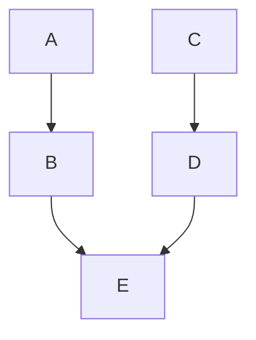
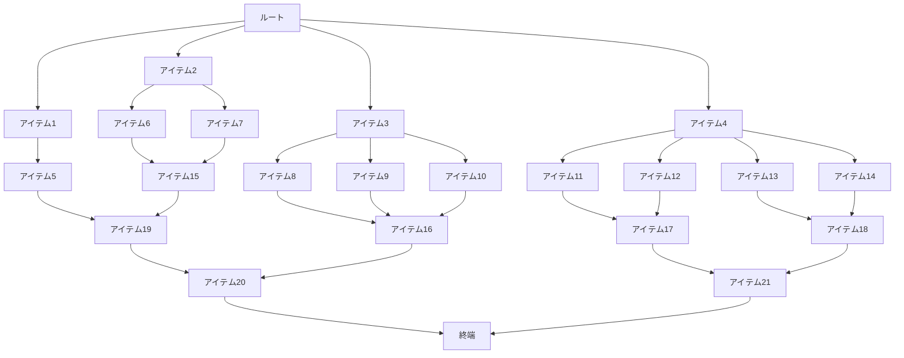
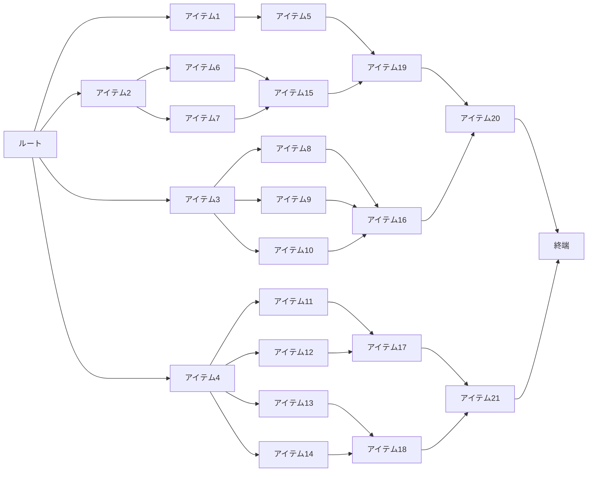
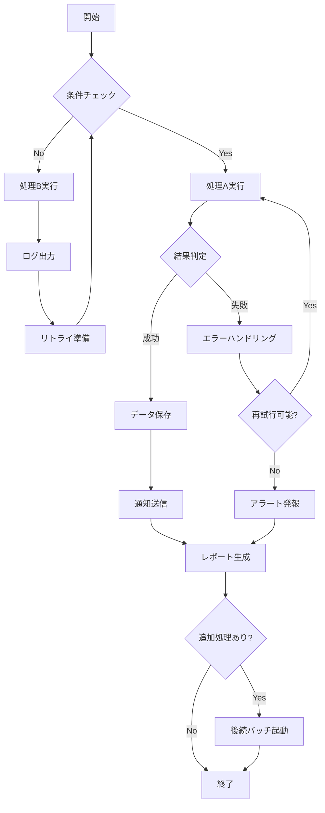
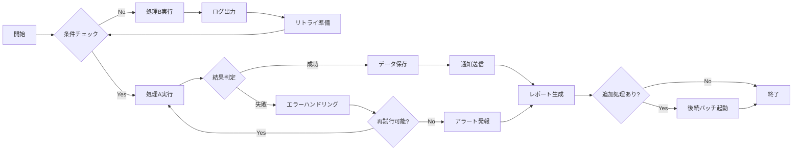
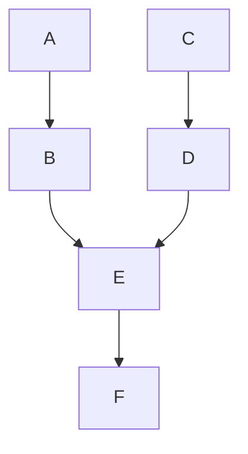

# 実験場


## 独自コンポーネント使用


### タイトルなし



* 横方向 + コードの開始行番号を8行目にしたバージョン

    ```mermaid (start:8)
    graph LR
        A --> B
        C --> D
        B --> E
        D --> E
    ```


### タイトルあり


### 多数項目





## AIに作成してもらったMermaidサンプル集

### Claude Code Opus 4.6に作成してもらったサンプル

::: code-group


:::
## Deatilsでの使用

::: details 独自コンポーネント使用



:::

## Error

### 空

```mermaid
```
