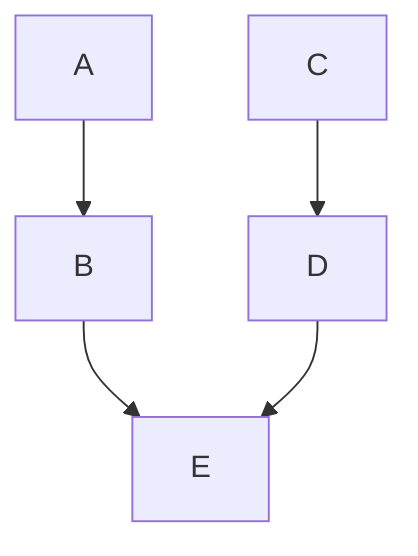
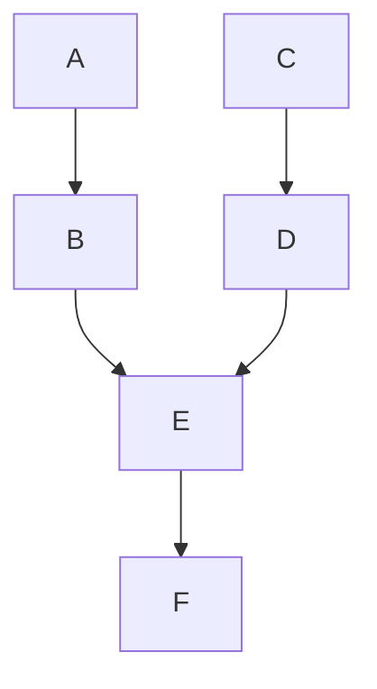
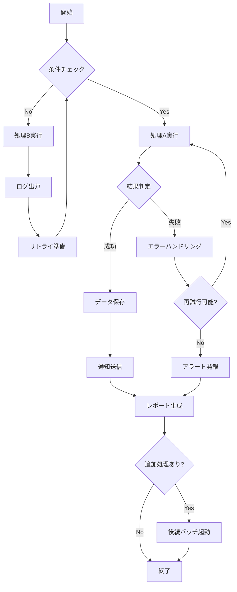

# 実験場


## 独自コンポーネント使用


### タイトルなし



* 横方向 + コードの開始行番号を8行目にしたバージョン

    ```mermaid (start:8)
    graph LR
        A --> B
        C --> D
        B --> E
        D --> E
    ```


### タイトルあり


## バイパス使用

### デフォルト


### 行番号を10から始める


### 1行目をハイライトする


### 表示上の行番号を10から始め、3行目の行をハイライトする


### 3行目と5行目をハイライトする


### 3行目～5行目をハイライトする


### 1行目と3行目～5行目をハイライトする


## AIに作成してもらったMermaidサンプル集




## Deatilsでの使用

### 独自コンポーネント使用

::: details 独自コンポーネント使用


:::

### バイパス

::: details バイパス


:::