# Mermaid サンプル集B（大規模版）


::: info

このファイルのコンテンツはClaude Code Opus 4.6に作成してもらったものです。

なお、作成依頼時のプロンプトは以下になります。
(サンプル集Aの後に続けて依頼)

```
少し規模が大きいバージョンの作成をお願いします。
なお、表示文字列についてはダブルクォーテーションで囲ってください。
```
:::

---

## 1. フローチャート (Flowchart)

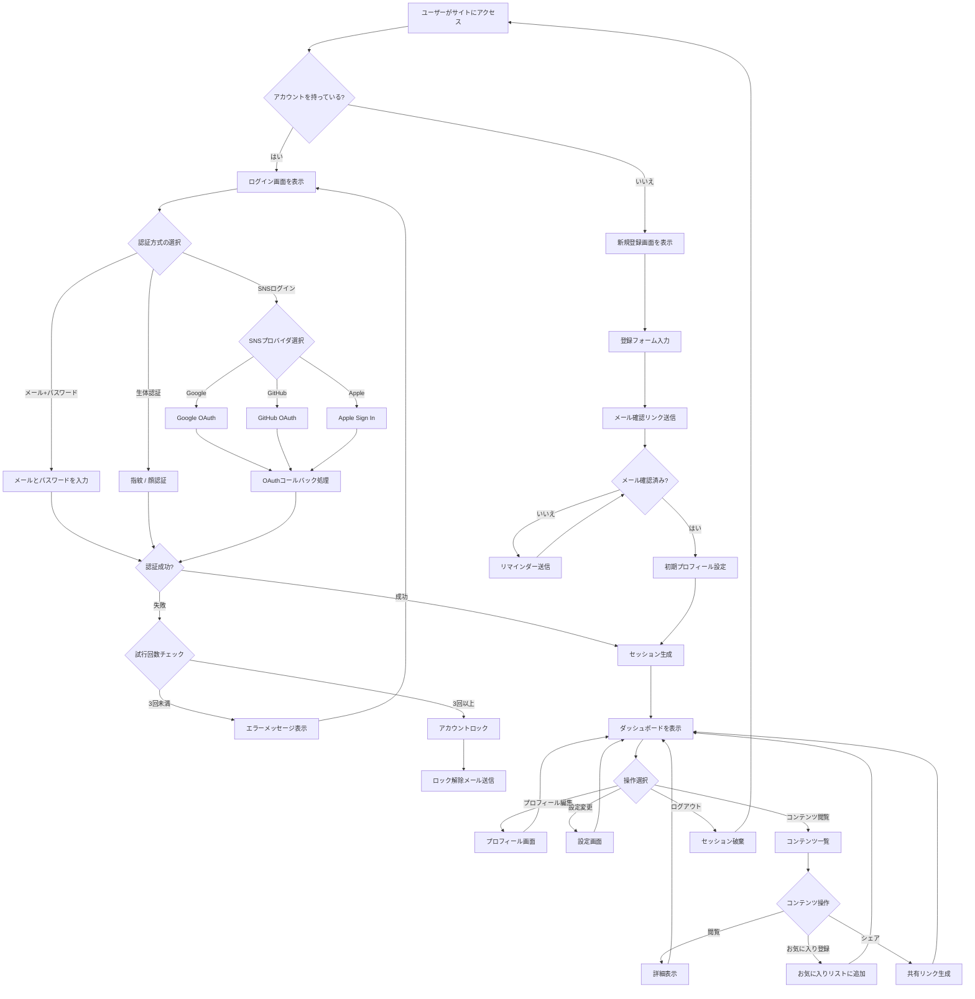

---

## 2. シーケンス図 (Sequence Diagram)

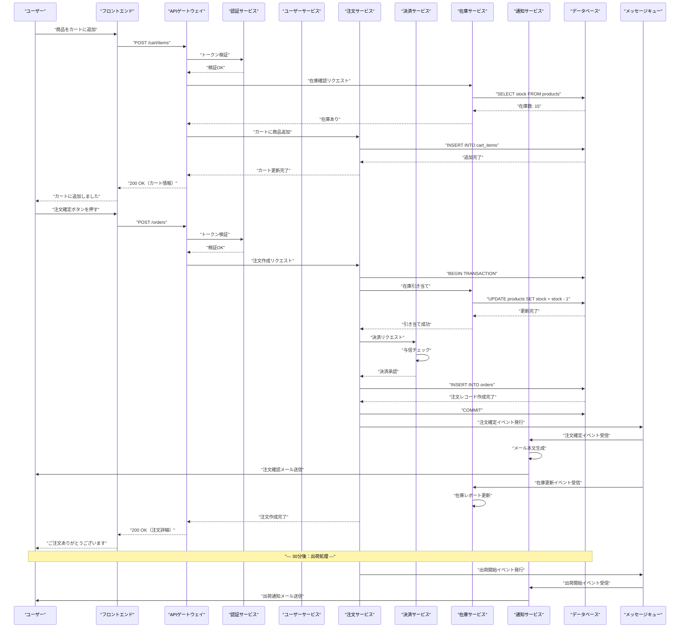

---

## 3. クラス図 (Class Diagram)

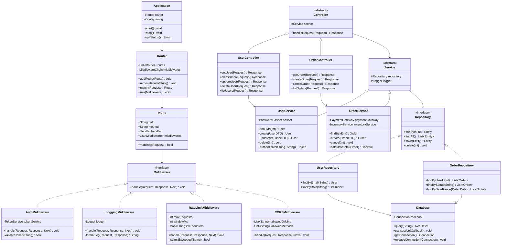

---

## 4. 状態遷移図 (State Diagram)

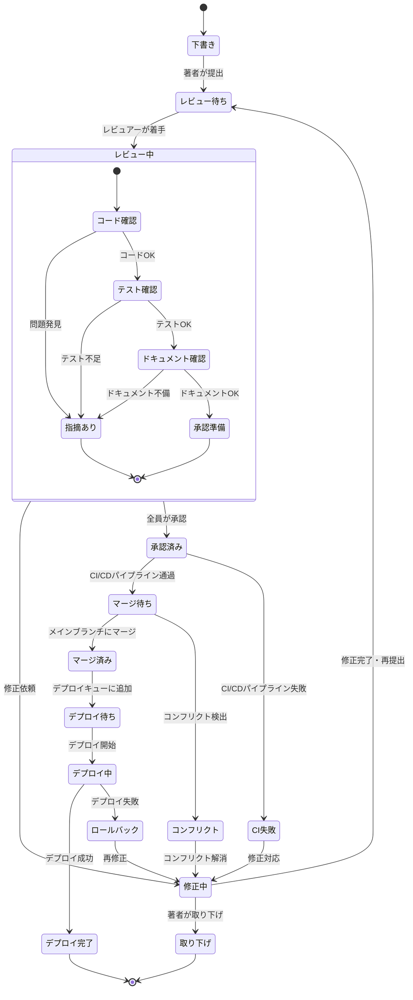

---

## 5. ER図 (Entity Relationship Diagram)

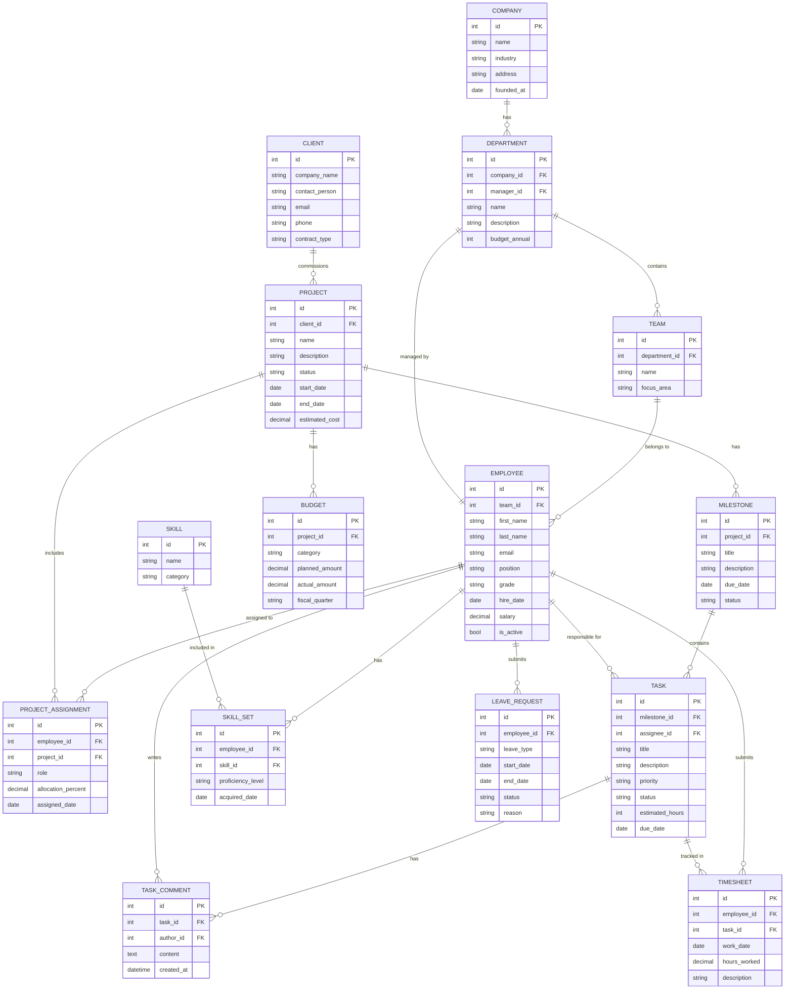

---

## 6. ガントチャート (Gantt Chart)

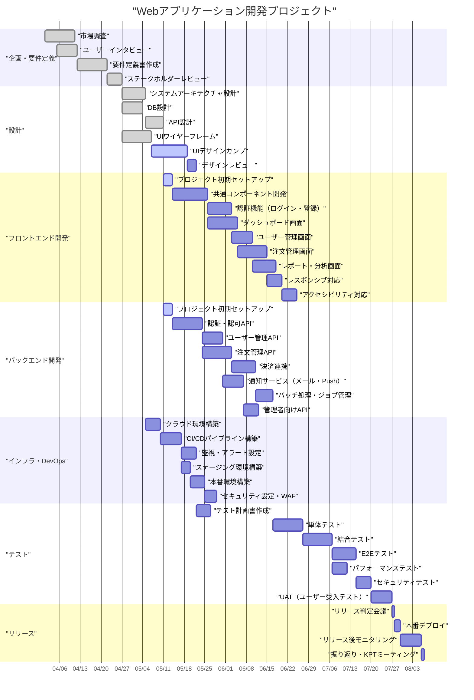

---

## 7. 円グラフ (Pie Chart)

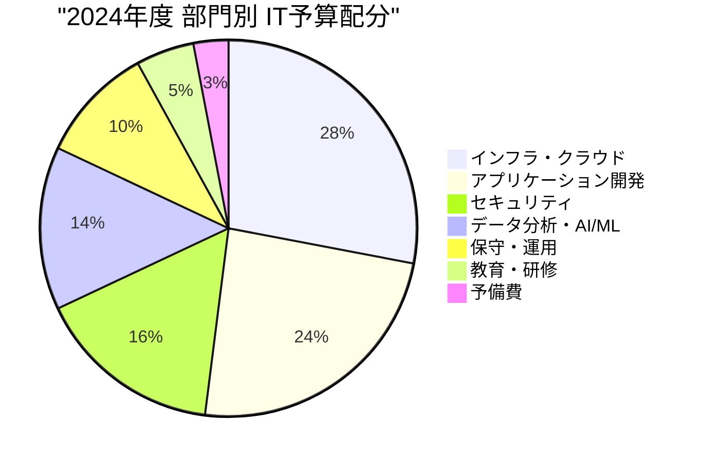

---

## 8. Git グラフ (Git Graph)

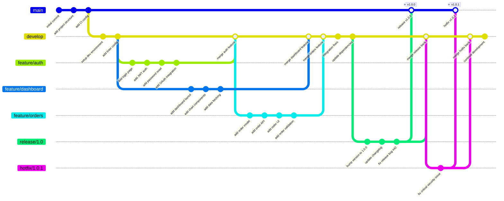

---

## 9. マインドマップ (Mindmap)

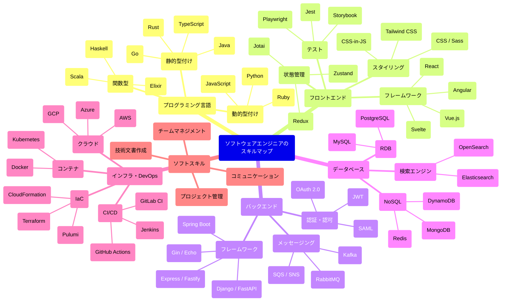

---

## 10. タイムライン (Timeline)

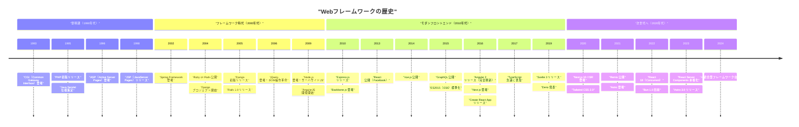

---

## 11. カスタマージャーニー (User Journey)

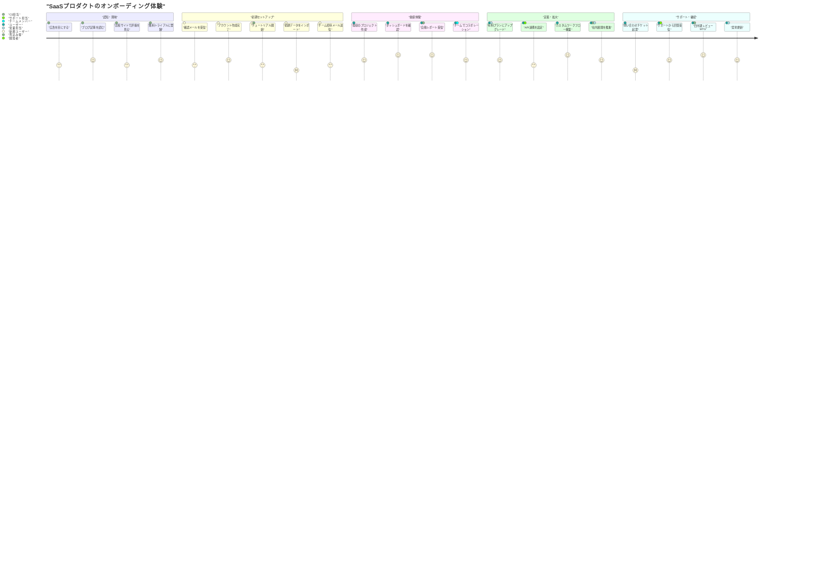

---

## 12. 要件図 (Requirement Diagram)

```mermaid
requirementDiagram

    requirement "高可用性" {
        id: "REQ-001"
        text: "システム全体で99.95%以上の可用性を維持すること"
        risk: high
        verifymethod: test
    }

    requirement "レスポンス性能" {
        id: "REQ-002"
        text: "API応答時間はP95で200ms以内であること"
        risk: high
        verifymethod: test
    }

    requirement "スケーラビリティ" {
        id: "REQ-003"
        text: "同時接続10万ユーザーに対応可能であること"
        risk: high
        verifymethod: analysis
    }

    requirement "データ暗号化" {
        id: "REQ-004"
        text: "保存データおよび通信データをAES-256で暗号化すること"
        risk: medium
        verifymethod: inspection
    }

    requirement "監査ログ" {
        id: "REQ-005"
        text: "全ての管理操作を監査ログに記録し1年間保持すること"
        risk: medium
        verifymethod: test
    }

    requirement "自動バックアップ" {
        id: "REQ-006"
        text: "データベースを日次で自動バックアップし30日間保持すること"
        risk: medium
        verifymethod: test
    }

    requirement "アクセス制御" {
        id: "REQ-007"
        text: "RBAC（ロールベースアクセス制御）を実装すること"
        risk: medium
        verifymethod: test
    }

    requirement "多言語対応" {
        id: "REQ-008"
        text: "日本語・英語・中国語に対応すること"
        risk: low
        verifymethod: demonstration
    }

    element "ロードバランサー" {
        type: "infrastructure"
    }

    element "APIサーバー群" {
        type: "service"
    }

    element "データベースクラスター" {
        type: "infrastructure"
    }

    element "認証サービス" {
        type: "service"
    }

    element "暗号化モジュール" {
        type: "module"
    }

    element "ログ収集基盤" {
        type: "infrastructure"
    }

    element "i18nライブラリ" {
        type: "module"
    }

    element "バックアップジョブ" {
        type: "service"
    }

    "ロードバランサー" - satisfies -> "高可用性"
    "ロードバランサー" - satisfies -> "スケーラビリティ"
    "APIサーバー群" - satisfies -> "レスポンス性能"
    "APIサーバー群" - satisfies -> "スケーラビリティ"
    "APIサーバー群" - satisfies -> "高可用性"
    "データベースクラスター" - satisfies -> "高可用性"
    "認証サービス" - satisfies -> "アクセス制御"
    "暗号化モジュール" - satisfies -> "データ暗号化"
    "ログ収集基盤" - satisfies -> "監査ログ"
    "i18nライブラリ" - satisfies -> "多言語対応"
    "バックアップジョブ" - satisfies -> "自動バックアップ"
```
