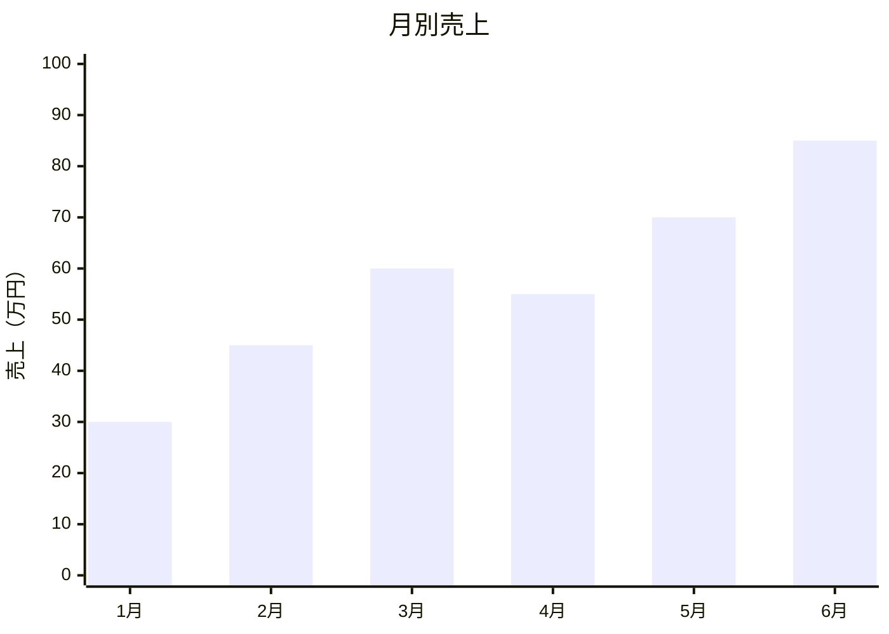
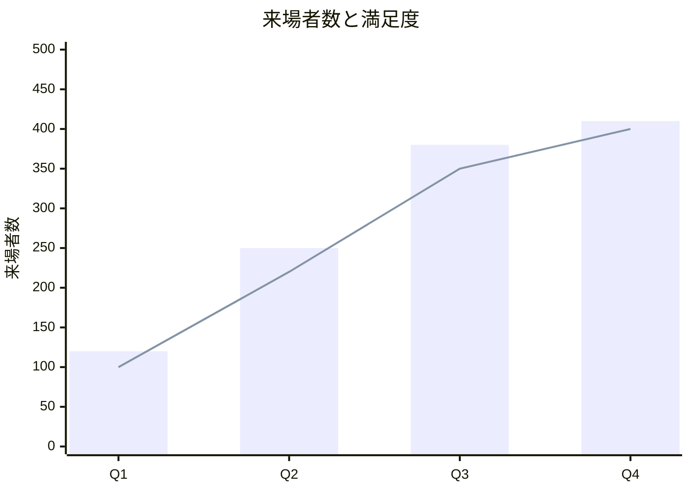
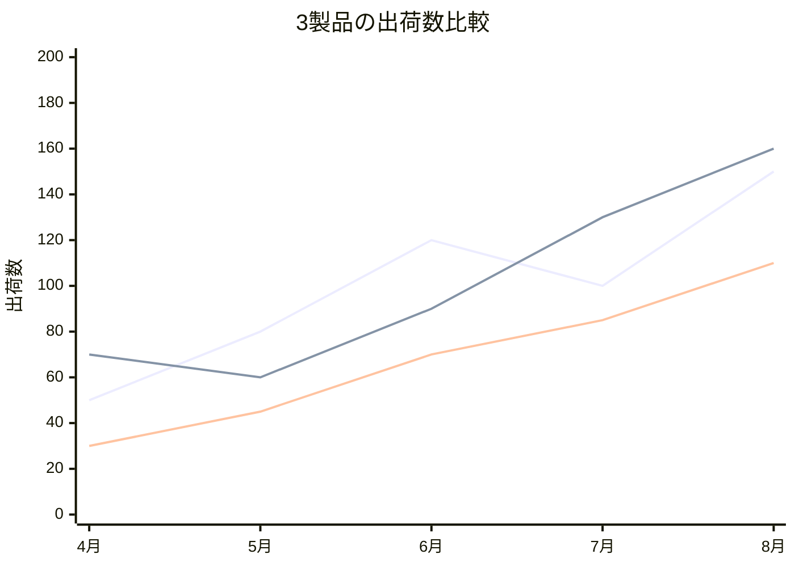
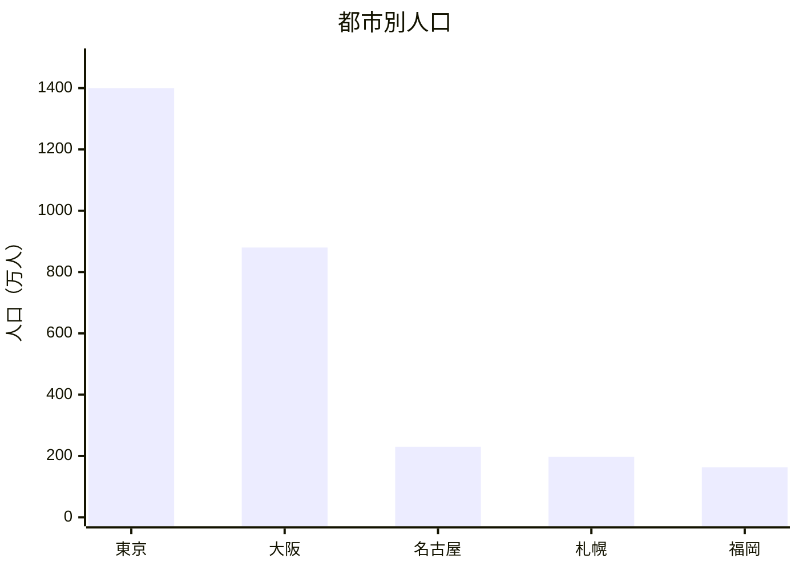
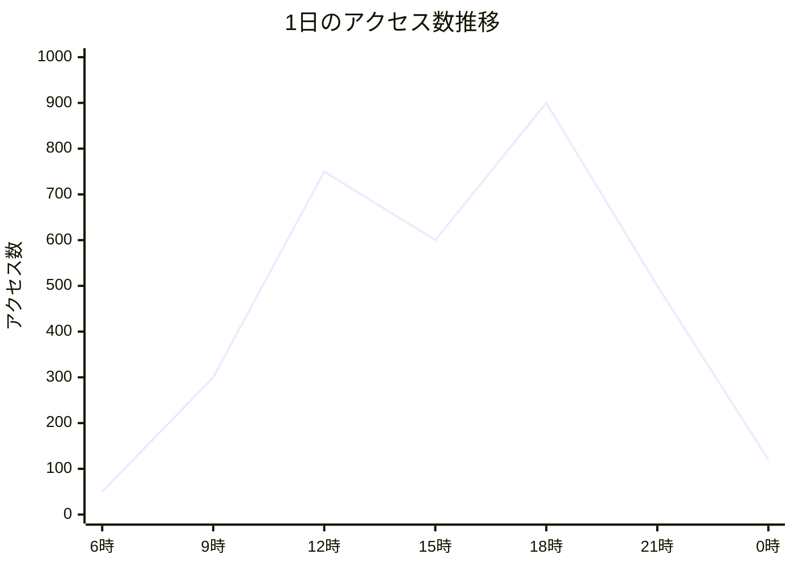
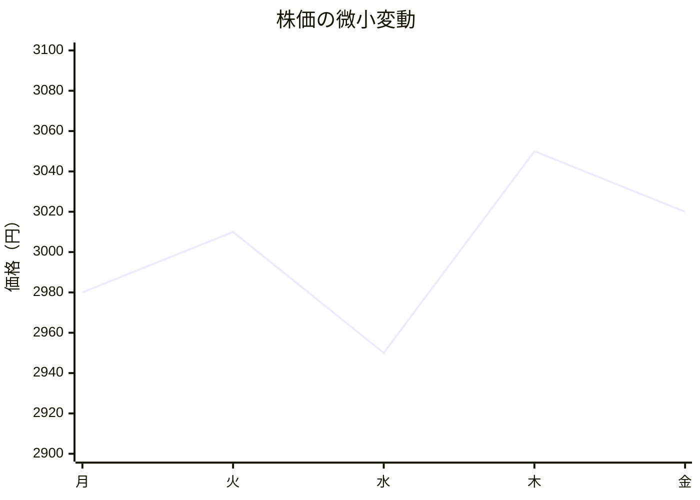
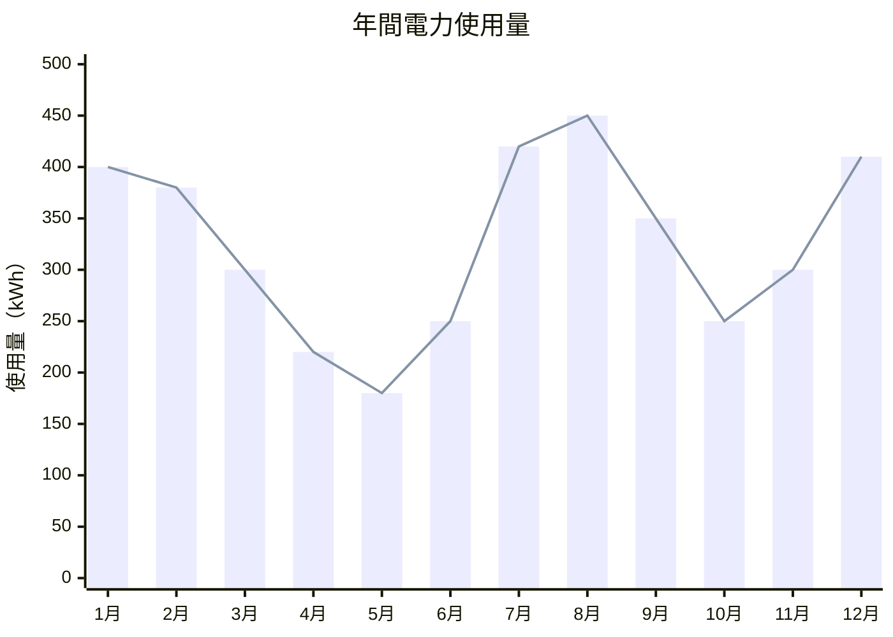

# Mermaid XY Chart サンプル集

::: info

このファイルのコンテンツはClaude Code Opus 4.6に作成してもらったものです。

なお、作成依頼時のプロンプトは以下になります。

```
MermaidにおけるXY Chartのサンプルを複数作成し、それらをまとめたMarkdownファイルを作成してください。
Mermaidにする内容については、特に意味がなくて問題ありません。
なお、表示文字列についてはダブルクォーテーションで囲ってください。
```
:::

## 1. 基本的な棒グラフ



---

## 2. 基本的な折れ線グラフ

```mermaid
xychart-beta
    title "気温の推移"
    x-axis ["月", "火", "水", "木", "金", "土", "日"]
    y-axis "気温（℃）" 0 --> 40
    line [22, 25, 28, 30, 27, 24, 23]
```

---

## 3. 棒グラフと折れ線グラフの複合



---

## 4. 複数の折れ線グラフ



---

## 5. 大きな値の棒グラフ



---

## 6. 細かいデータの折れ線グラフ



---

## 7. 複数の棒グラフ

```mermaid
xychart-beta
    title "部門別予算と実績"
    x-axis ["営業", "開発", "人事", "広報"]
    y-axis "金額（百万円）" 0 --> 60
    bar [50, 40, 20, 15]
    bar [45, 48, 18, 12]
```



---

## 8. 棒グラフ複数＋折れ線

```mermaid
xychart-beta
    title "月次レポート"
    x-axis ["1月", "2月", "3月", "4月", "5月", "6月"]
    y-axis "件数" 0 --> 300
    bar [100, 130, 160, 140, 200, 250]
    bar [80, 110, 140, 120, 170, 220]
    line [90, 120, 150, 130, 185, 235]
```



---

## 9. y軸の範囲を狭めたグラフ



---

## 10. 12ヶ月の年間推移

