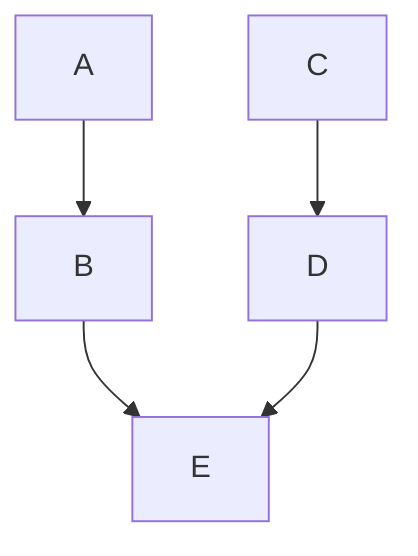

# 導入手順書

## 前提

VitePressのセットアップウィザードでは、以下のように、**Theme** を **Default Theme + Customization** に設定していること。

```plain {15-16}
T  Welcome to VitePress!
|
o  Where should VitePress initialize the config?
|  ./docs
|
o  Where should VitePress look for your markdown files?
|  ./docs
|
o  Site title:
|  My Awesome Project
|
o  Site description:
|  A VitePress Site
|
o  Theme:
|  Default Theme + Customization
|
o  Use TypeScript for config and theme files?
|  Yes
|
o  Add VitePress npm scripts to package.json?
|  Yes
|
o  Add a prefix for VitePress npm scripts?
|  Yes
|
o  Prefix for VitePress npm scripts:
|  docs
|
—  Done! Now run npm run docs:dev and start writing.
```

::: tip
以後の手順は、VitePressのセットアップウィザードにて以上の内容でセットアップした直後における操作の例を示したものである
:::

## インストール

```shell
npm install github:hirosof/mermaid-diagram-for-vitepress2
```

## 初期設定

以下を参考に設定を行ってください。

### `docs\.vitepress\config.mts`

::: code-group
```typescript [設定前]
import { defineConfig } from 'vitepress'

// https://vitepress.dev/reference/site-config
export default defineConfig({
  title: "My Awesome Project",
  description: "A VitePress Site",
  themeConfig: {
    // https://vitepress.dev/reference/default-theme-config
    nav: [
      { text: 'Home', link: '/' },
      { text: 'Examples', link: '/markdown-examples' }
    ],

    sidebar: [
      {
        text: 'Examples',
        items: [
          { text: 'Markdown Examples', link: '/markdown-examples' },
          { text: 'Runtime API Examples', link: '/api-examples' }
        ]
      }
    ],

    socialLinks: [
      { icon: 'github', link: 'https://github.com/vuejs/vitepress' }
    ]
  }
})
```
```typescript [設定後]
import { defineConfig } from 'vitepress'
import { withMermaidDiagramRenderer } from 'mermaid-diagram-for-vitepress2'

// https://vitepress.dev/reference/site-config
const config = defineConfig({
  title: "My Awesome Project",
  description: "A VitePress Site",
  themeConfig: {
    // https://vitepress.dev/reference/default-theme-config
    nav: [
      { text: 'Home', link: '/' },
      { text: 'Examples', link: '/markdown-examples' }
    ],

    sidebar: [
      {
        text: 'Examples',
        items: [
          { text: 'Markdown Examples', link: '/markdown-examples' },
          { text: 'Runtime API Examples', link: '/api-examples' }
        ]
      }
    ],

    socialLinks: [
      { icon: 'github', link: 'https://github.com/vuejs/vitepress' }
    ]
  }
})

export default withMermaidDiagramRenderer(config)
```

```typescript [差分表記]
import { defineConfig } from 'vitepress'
import { withMermaidDiagramRenderer } from 'mermaid-diagram-for-vitepress2' // [!code ++]

// https://vitepress.dev/reference/site-config
export default defineConfig({ // [!code --]
const config = defineConfig({ // [!code ++]
  title: "My Awesome Project",
  description: "A VitePress Site",
  themeConfig: {
    // https://vitepress.dev/reference/default-theme-config
    nav: [
      { text: 'Home', link: '/' },
      { text: 'Examples', link: '/markdown-examples' }
    ],

    sidebar: [
      {
        text: 'Examples',
        items: [
          { text: 'Markdown Examples', link: '/markdown-examples' },
          { text: 'Runtime API Examples', link: '/api-examples' }
        ]
      }
    ],

    socialLinks: [
      { icon: 'github', link: 'https://github.com/vuejs/vitepress' }
    ]
  }
})

export default withMermaidDiagramRenderer(config) // [!code ++]
```
:::


### `docs\.vitepress\theme\index.ts`


::: code-group
```typescript [設定前]
// https://vitepress.dev/guide/custom-theme
import { h } from 'vue'
import type { Theme } from 'vitepress'
import DefaultTheme from 'vitepress/theme'
import './style.css'

export default {
  extends: DefaultTheme,
  Layout: () => {
    return h(DefaultTheme.Layout, null, {
      // https://vitepress.dev/guide/extending-default-theme#layout-slots
    })
  },
  enhanceApp({ app, router, siteData }) {
    // ...
  }
} satisfies Theme

```
```typescript [設定後]
// https://vitepress.dev/guide/custom-theme
import { h } from 'vue'
import type { Theme } from 'vitepress'
import DefaultTheme from 'vitepress/theme'
import './style.css'
import {registerMermaidDiagramRendererComponent} from 'mermaid-diagram-for-vitepress2/register'
import 'mermaid-diagram-for-vitepress2/style'

export default {
  extends: DefaultTheme,
  Layout: () => {
    return h(DefaultTheme.Layout, null, {
      // https://vitepress.dev/guide/extending-default-theme#layout-slots
    })
  },
  enhanceApp({ app, router, siteData }) {
    // ...
    registerMermaidDiagramRendererComponent({app , router ,siteData});
  }
} satisfies Theme
```

```typescript [差分表記]
// https://vitepress.dev/guide/custom-theme
import { h } from 'vue'
import type { Theme } from 'vitepress'
import DefaultTheme from 'vitepress/theme'
import './style.css'
import {registerMermaidDiagramRendererComponent} from 'mermaid-diagram-for-vitepress2/register' // [!code ++]
import 'mermaid-diagram-for-vitepress2/style' // [!code ++]

export default {
  extends: DefaultTheme,
  Layout: () => {
    return h(DefaultTheme.Layout, null, {
      // https://vitepress.dev/guide/extending-default-theme#layout-slots
    })
  },
  enhanceApp({ app, router, siteData }) {
    // ...
    registerMermaidDiagramRendererComponent({app , router ,siteData}); // [!code ++]
  }
} satisfies Theme

```
:::


## 実際に使う

これで、インストール及び初期設定を完了しました。

あとは、通常通り、Markdownのコードブロックにて、
以下のように、mermaidの言語を指定してください。

::: code-group
````markdown [Markdownのコードブロック]

````


:::

